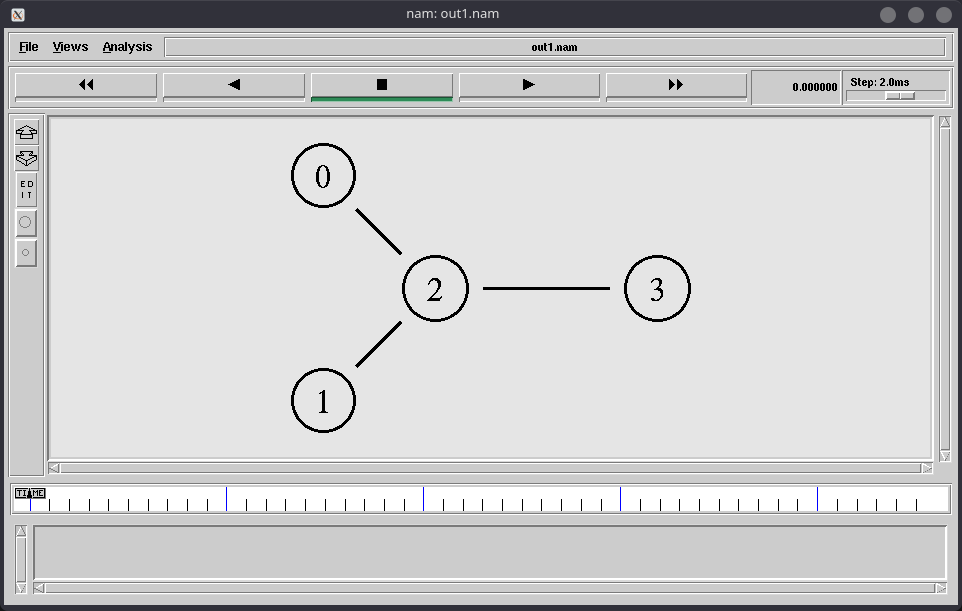

# Ex.No.8 - Study Of TCP/UDP Performance Using Simulation Tool

```
$ ns sim.tcl
```

Execution :

1. Run `ns sim.tcl` in terminal.
2. Run `awk -f trace.awk out1.tr` in terminal.

OUTPUT:

`ns sim.tcl`

```
CBR packet size = 1000
CBR interval = 0.0080000000000000002
```



`awk -f trace.awk out1.tr`

```
The number of packets dropped = 18
```